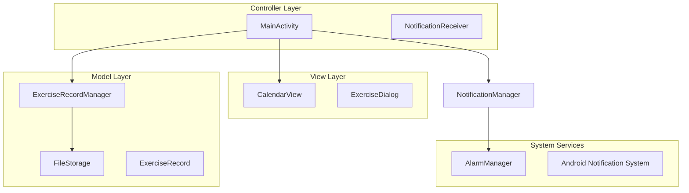

# 设计文档

## 概述

运动记录应用是一个Android原生应用，采用简洁的架构设计来实现日历界面的运动记录功能。应用使用Android内置的CalendarView组件作为主界面，通过JSON文件进行本地数据存储，并使用AlarmManager实现精确的每日通知提醒。

设计重点关注简单性和可靠性，避免过度工程化，确保在资源有限的环境下（10用户，1000条记录）能够稳定运行。

## 架构

应用采用简化的MVC（Model-View-Controller）架构模式：



### 架构层次说明

- **View Layer**: 负责用户界面显示和交互
- **Controller Layer**: 处理用户输入和协调各组件
- **Model Layer**: 管理数据和业务逻辑
- **System Services**: Android系统服务集成

## 组件和接口

### 1. MainActivity (主控制器)

**职责**: 应用的主入口点，协调所有组件的交互

**关键方法**:
```kotlin
class MainActivity : AppCompatActivity() {
    fun onCreate(savedInstanceState: Bundle?)
    fun onCalendarDateClick(date: Date)
    fun showExerciseDialog(date: Date)
    fun updateCalendarDisplay()
    fun setupNotifications()
}
```

**接口依赖**:
- CalendarView (Android内置)
- ExerciseRecordManager
- NotificationManager

### 2. ExerciseRecordManager (数据管理器)

**职责**: 管理运动记录的创建、存储和检索

**关键方法**:
```kotlin
class ExerciseRecordManager(private val fileStorage: FileStorage) {
    fun createRecord(date: Date, exercised: Boolean, duration: Int?): ExerciseRecord
    fun getRecord(date: Date): ExerciseRecord?
    fun getAllRecords(): List<ExerciseRecord>
    fun saveRecord(record: ExerciseRecord)
}
```

**接口依赖**:
- FileStorage
- ExerciseRecord

### 3. FileStorage (文件存储)

**职责**: 处理JSON文件的读写操作和数据持久化

**关键方法**:
```kotlin
class FileStorage(private val context: Context) {
    fun saveRecords(records: List<ExerciseRecord>)
    fun loadRecords(): List<ExerciseRecord>
    fun ensureDataRecovery(): Boolean
    private fun getStorageFile(): File
}
```

**存储格式**: JSON数组，每个记录包含日期、运动状态和时长

### 4. ExerciseDialog (运动选择对话框)

**职责**: 显示运动记录输入界面

**关键方法**:
```kotlin
class ExerciseDialog : DialogFragment() {
    fun show(date: Date, callback: (Boolean, Int?) -> Unit)
    private fun showExerciseOptions()
    private fun showDurationOptions()
}
```

**界面流程**:
1. 显示"是否运动"选择
2. 如果选择"是"，显示时长选择（20/30/40分钟）
3. 返回选择结果给调用者

### 5. NotificationManager (通知管理器)

**职责**: 管理每日11:30的运动提醒通知

**关键方法**:
```kotlin
class NotificationManager(private val context: Context) {
    fun scheduleDaily1130Notification()
    fun createNotificationChannel()
    fun showExerciseReminder()
}
```

**接口依赖**:
- AlarmManager (Android系统服务)
- NotificationReceiver

### 6. NotificationReceiver (通知接收器)

**职责**: 处理AlarmManager触发的通知事件

**关键方法**:
```kotlin
class NotificationReceiver : BroadcastReceiver() {
    override fun onReceive(context: Context, intent: Intent)
    private fun showNotification(context: Context)
}
```

## 数据模型

### ExerciseRecord (运动记录)

```kotlin
data class ExerciseRecord(
    val date: String,        // ISO 8601格式: "2024-01-15"
    val exercised: Boolean,  // 是否运动
    val duration: Int?       // 运动时长（分钟），null表示未运动
) {
    fun getDisplayText(): String {
        return if (exercised && duration != null) {
            "已运动 ${duration}分钟"
        } else {
            ""
        }
    }
}
```

### JSON存储格式

```json
[
    {
        "date": "2024-01-15",
        "exercised": true,
        "duration": 30
    },
    {
        "date": "2024-01-16",
        "exercised": false,
        "duration": null
    }
]
```

## 正确性属性

*属性是一个特征或行为，应该在系统的所有有效执行中保持为真——本质上是关于系统应该做什么的正式陈述。属性作为人类可读规范和机器可验证正确性保证之间的桥梁。*

### 属性 1: 日历显示信息准确性
*对于任何*已记录运动的日期，日历上显示的信息应该与存储的运动记录中的时长信息完全匹配
**验证: 需求 1.3**

### 属性 2: 日期点击交互一致性
*对于任何*日历上可点击的日期，点击后都应该弹出运动选择界面
**验证: 需求 2.1**

### 属性 3: 运动记录创建完整性
*对于任何*有效的日期和运动选择组合，创建的运动记录应该包含正确的日期、运动状态和时长信息
**验证: 需求 2.5**

### 属性 4: 数据持久化往返一致性
*对于任何*运动记录，保存到文件存储后再加载应该产生等价的记录数据
**验证: 需求 3.1**

### 属性 5: 通知时间精确性
*对于任何*给定的日期，系统应该在该日期的11:30准确发送通知
**验证: 需求 4.1**

### 属性 6: 记录不可变性保证
*对于任何*已创建的运动记录，系统不应提供修改或删除该记录的功能
**验证: 需求 5.1, 5.2**

## 错误处理

### 文件存储错误
- **文件读取失败**: 返回空记录列表，记录错误日志
- **文件写入失败**: 显示用户友好错误消息，保持内存中数据
- **JSON解析错误**: 尝试恢复部分数据，记录损坏条目

### 通知系统错误
- **AlarmManager设置失败**: 记录错误，在应用启动时重试
- **通知权限被拒绝**: 显示权限请求对话框

### 用户界面错误
- **日期选择异常**: 默认使用当前日期
- **对话框显示失败**: 使用Toast显示简化选项

## 测试策略

### 双重测试方法

应用将采用单元测试和基于属性的测试相结合的综合测试策略：

**单元测试**:
- 验证具体示例和边界情况
- 测试组件集成点
- 验证错误条件处理
- 关注特定的用户场景

**基于属性的测试**:
- 验证跨所有输入的通用属性
- 通过随机化实现全面的输入覆盖
- 每个属性测试最少运行100次迭代
- 每个测试必须引用其设计文档属性

**属性测试配置**:
使用Kotlin的property-based testing库（如Kotest Property Testing）实现属性验证。每个正确性属性将通过单独的属性测试实现，标签格式为：**Feature: exercise-tracker, Property {number}: {property_text}**

**测试覆盖范围**:
- ExerciseRecordManager: 数据创建和检索逻辑
- FileStorage: JSON序列化和文件操作
- NotificationManager: 通知调度和触发
- MainActivity: 用户交互和组件协调
- 集成测试: 端到端用户流程验证